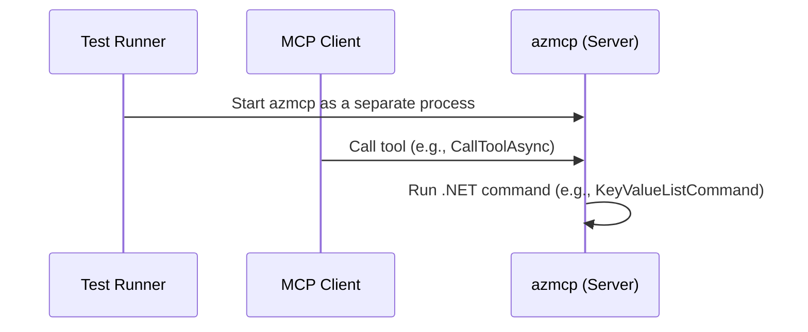
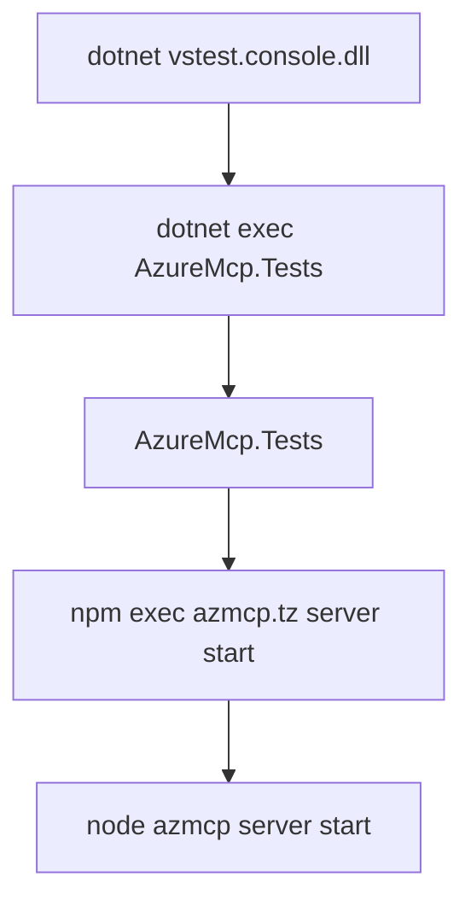

# Debugging Azure MCP Server Live Test in VS Code

This guide provides step-by-step instructions for debugging the Azure MCP Server (`azmcp`) when running live tests in VS Code. The live test suites can be found in the [tests/Client](https://github.com/Azure/azure-mcp/tree/main/tests/Client) directory of the repository.

## Prerequisites

Before proceeding, ensure you have deployed the required Azure test resources for live tests by running [`/eng/common/TestResources/New-TestResources.ps1`](https://github.com/Azure/azure-mcp/blob/main/eng/common/TestResources/New-TestResources.ps1). Running this script produces a `.testsettings.json` file with your deployment information at the root of your local repository clone. For more details on deploying test resources, see the [Live Tests](https://github.com/Azure/azure-mcp/blob/main/CONTRIBUTING.md#live-tests) section in the CONTRIBUTING document.

## Overview

When launching a live test in debug mode:

1. The test starts `azmcp` (the Azure MCP Server) executable as a separate process.
2. The test uses MCP Client to invoke tools exposed by the `azmcp` process.
3. Invocation of a tool runs the corresponding .NET command code included in the `azmcp`. For example:
    * invoking the tool `mcpClient.CallToolAsync("azmcp-appconfig-kv-list", ..)` will run the command `AzureMcp.Commands.AppConfig.KeyValue.KeyValueListCommand` in `azmcp`.



if a snapshot of the process tree spun up by a test run is taken, the tree should appear as follows:



> **Note:** The actual name of the package `azmcp.tz`  (in block 4) may be something like `azure-mcp-0.1.1-alpha.1748757601.tgz`, this is the package containing the `azmcp` server and its command implementations.

To debug the `azmcp` process, it is necessary to:

1. Build the package with debug symbols
2. Start the MCP server in debug mode so it waits for the debugger to attach
3. Ensure the MCP Client does not timeout while waiting to attach to the `azmcp` process

By default, [`/eng/scripts/Build-Local.ps1`](https://github.com/Azure/azure-mcp/blob/main/eng/scripts/Build-Local.ps1) builds the `azure-mcp-0.1.1-alpha.xxxxxxxxxx.tgz` package in Release mode. The script supports a `-DebugBuild` argument to build the `azmcp` package with debug symbols.

The `azmcp` supports a `--debug` command-line argument. When this argument is provided and running in Debug mode, the server will wait for a debugger to attach. The live test harness is already configured to pass `--debug` to `azmcp` when running in Debug mode.

## Debugging the test

1. Build the package with debug symbols by running `/eng/scripts/Build-Local.ps1 -DebugBuild`.
2. Set a breakpoint in a command file (e.g., [`KeyValueListCommand.ExecuteAsync`](https://github.com/Azure/azure-mcp/blob/main/src/Commands/AppConfig/KeyValue/KeyValueListCommand.cs#L59)).
3. In VS Code, right-click the test method (e.g., [`AppConfigCommandTests::Should_list_appconfig_kvs()`](https://github.com/Azure/azure-mcp/blob/main/tests/Client/AppConfigCommandTests.cs#L48)) and select **Debug Test** (🐞).
4. Find the `azmcp` process ID 

```shell
pgrep -fl azmcp
```

```powershell
Get-Process | Where-Object { $_.ProcessName -like "*azmcp*" } | Select-Object Id, ProcessName, Path
```
5. Open the Command Palette (`Cmd+Shift+P` on Mac, `Ctrl+Shift+P` on Windows/Linux), select **Debug: Attach to .NET 5+ or .NET Core process**, and enter the `azmcp` process ID.
6. The debugger should attach to `azmcp` and hit the breakpoint in command file.

