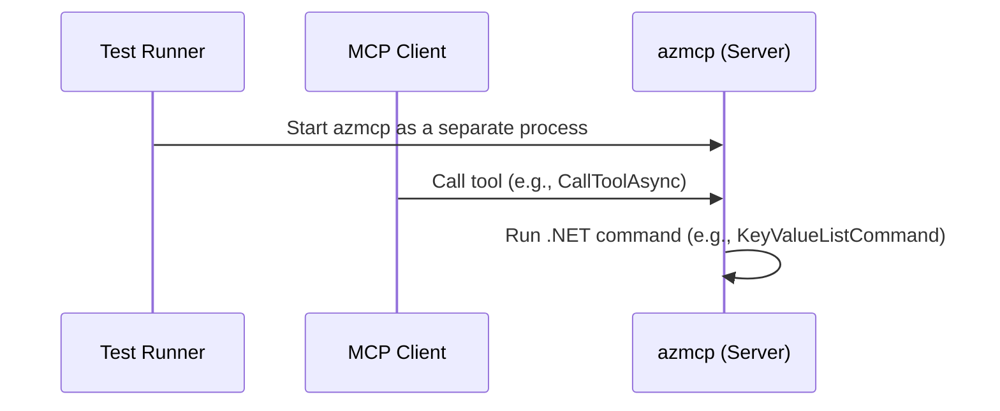
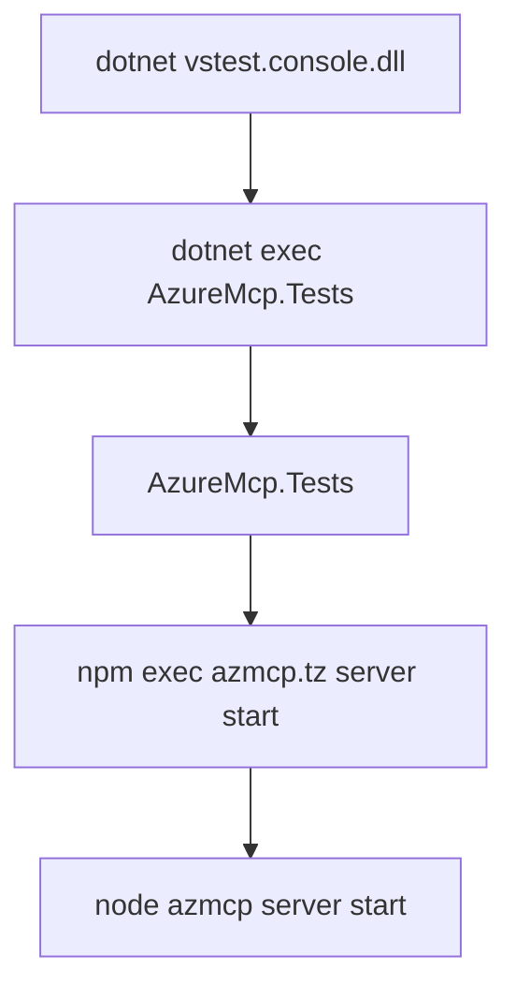

# Debugging Azure MCP Server Live Test in VS Code

This guide provides step-by-step instructions for debugging the Azure MCP Server (`azmcp`) when running live tests in VS Code. The live test suites can be found in the [tests/Client](./../../tests/Client) directory of the repository.

## Prerequisites

Before proceeding, ensure you have deployed the required Azure test resources for live tests by running [`/eng/common/TestResources/New-TestResources.ps1`](../../eng/common/TestResources/New-TestResources.ps1). Running this script produces `.testsettings.json` file with your deployment information at the root of your local repository clone. For more details on deploying test resources, see the [Live Tests](https://github.com/Azure/azure-mcp/blob/main/CONTRIBUTING.md#live-tests) section in the CONTRIBUTING document.

## Overview

When launching a live test in debug mode,


1. The test starts `azmcp` (the Azure MCP Server) executable as a separate process.
2. The test uses MCP Client to invoke tools exposed by the `azmcp` process.
3. Invocation of a tool runs the corresponding .NET command code included in the `azmcp`. For example:
    * Calling tool: `mcpClient.CallToolAsync("azmcp-appconfig-kv-list", ..)`
    * Runs the command: `AzureMcp.Commands.AppConfig.KeyValue.KeyValueListCommand` in `azmcp`



if a snapshot of the process tree spun up by a test run is taken, the tree should appear as follows:



> **Note:** The actual name of the package `azmcp.tz` may be something like `azure-mcp-0.1.1-alpha.1748757601.tgz` (step 4) is the package containing the `azmcp` server and its command implementations.

To debug the `azmcp` process, it is necessary to:

1. Build the package with debug symbols
2. Have the `azmcp` (Azure MCP Server) process waits for the Debugger to attach
3. Ensure the MCP Client does not timeout while waiting to attach to the `azmcp` process

The remainder of this document provides detailed instructions for each of the three steps outlined above.

## Including Debug Symbols

By default, [`/eng/scripts/Build-Module.ps1`](https://github.com/Azure/azure-mcp/blob/a00df9a64d05d274e59d22a689aaf805eef64304/eng/scripts/Build-Module.ps1) builds the `azure-mcp-0.1.1-alpha.xxxxxxxxxx.tgz` package in Release mode. To include debug symbols:

1. Open `Build-Module.ps1`.
2. Find the [`dotnet publish`](https://github.com/Azure/azure-mcp/blob/a00df9a64d05d274e59d22a689aaf805eef64304/eng/scripts/Build-Module.ps1#L75) command and append `/p:Configuration=Debug`:

```powershell
$command = "dotnet publish '$projectFile' --runtime '$os-$arch' --output '$outputDir/dist' /p:Version=$Version /p:Configuration=Debug"
```

## Updating MCP Client Initialization Timeout

1. Open [`LiveTestFixture.cs`](https://github.com/Azure/azure-mcp/blob/a00df9a64d05d274e59d22a689aaf805eef64304/tests/Client/Helpers/LiveTestFixture.cs#L36)
2. In the `InitializeAsync` method, set a longer timeout:

```csharp
var clientOptions = new McpClientOptions
{
  InitializationTimeout = TimeSpan.FromMinutes(60)
};
Client = await McpClientFactory.CreateAsync(clientTransport, clientOptions);
```

## Updating Azure MCP Server to Wait for Debugger

1. Open [`ServiceStartCommand.cs`](https://github.com/Azure/azure-mcp/blob/a00df9a64d05d274e59d22a689aaf805eef64304/src/Commands/Server/ServiceStartCommand.cs#L40).
2. Update the `ExecuteAsync` method code to
   - output the process ID to a file (not standard IO) and,
   - wait for the debugger to attach.

```csharp
public override async Task<CommandResponse> ExecuteAsync(CommandContext context, ParseResult parseResult)
{
#if DEBUG
    LogDebug("[ServiceStartCommand] ExecuteAsync called in debug mode");
    if (!System.Diagnostics.Debugger.IsAttached)
    {
        LogDebug("[ServiceStartCommand] Waiting for debugger to attach. PID: " + Environment.ProcessId);
        while (!System.Diagnostics.Debugger.IsAttached)
        {
            Thread.Sleep(100);
        }
        LogDebug("[ServiceStartCommand] Debugger Attached");
    }
#else
    LogDebug("[ServiceStartCommand] ExecuteAsync called in non-debug mode");
#endif
...
```

```csharp
private static void LogDebug(string message)
{
    var logPath = "/tmp/azmcp-server-debug.log";
    var logLine = $"{DateTime.UtcNow:O} {message}\n";
    System.IO.File.AppendAllText(logPath, logLine);
}
```

> **Note:** Do not write the process ID to standard IO; use a log file instead.

## Debugging the Test

1. Build the package with debug symbols by running `/eng/scripts/Build-Module.ps1`.
2. Set a breakpoint in a command file (e.g., [`KeyValueListCommand.ExecuteAsync`](https://github.com/Azure/azure-mcp/blob/a00df9a64d05d274e59d22a689aaf805eef64304/src/Commands/AppConfig/KeyValue/KeyValueListCommand.cs#L59)).
3. In VS Code, right-click the test method (e.g., [`AppConfigCommandTests::Should_list_appconfig_kvs()`](https://github.com/Azure/azure-mcp/blob/a00df9a64d05d274e59d22a689aaf805eef64304/tests/Client/AppConfigCommandTests.cs#L48)) and select **Debug Test** (🐞).
4. Wait for the server to log the process ID in `/tmp/azmcp-server-debug.log`.
5. Open the Command Palette (`Cmd+Shift+P` on Mac, `Ctrl+Shift+P` on Windows/Linux), select **Debug: Attach to .NET 5+ or .NET Core process**, and enter the process ID.
6. The debugger should attach and hit the breakpoint.

